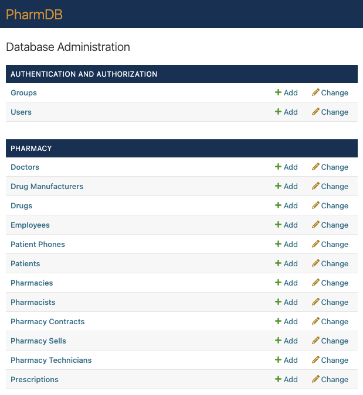
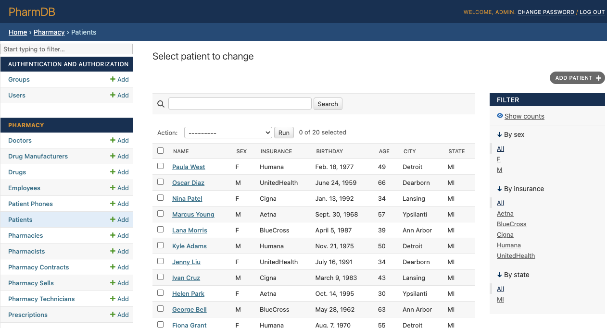

# CIS-421 Project - Pharmacy Database

A database design and SQL project for CIS-421 modeling a regional pharmacy
chain. Includes ER diagram, relational schema, SQLite database, 14 SQL queries,
and a [Django](https://www.djangoproject.com/) admin UI for live data browsing.

Project requirements are described in [INSTRUCTIONS.md](INSTRUCTIONS.md).

## Project Structure

- `PharmacyDB.db` - SQLite database
- `schema/` - relational schema (DDL) and sample data insert statements
- `queries/` - 14 SQL queries/updates with descriptions and outputs
- `docs/` - ER diagram, presentation, and report files
- `web/` - Django admin UI

## Running Queries

Requires [SQLite3](https://sqlite.org/download.html).

```bash
sqlite3 PharmacyDB.db
```

Then paste any query from `queries/queries.md`. For example:

```sql
SELECT name, city FROM Pharmacy;
```

Use `.quit` to exit.

## Running the Web UI

Requires [Python 3.10+](https://www.python.org/downloads/).

```bash
# Create the virtual environment
cd web
python3 -m venv .venv

# Activate the virtual environment:
# on Mac OS or Linux
. venv/bin/activate
# or on Windows
.\venv\Scripts\activate

# Install the dependencies, initialize the app, and run
pip install -r requirements.txt
python manage.py migrate
python manage.py collectstatic --no-input
python manage.py runserver
```

Then open http://127.0.0.1:8000/admin and log in:

- **Username:** `admin@example.com`
- **Password:** `goblue!`

(Credentials are set in `web/.env.dev`)

## Screenshots

The Django admin interface provides a user-friendly way to browse, search, and
manage all database entities.

**Admin Home**



Browse all models including pharmacies, employees, patients, prescriptions, and
drug inventory.

**Patient Management**



Search, filter, and view detailed patient records with related data like phone
numbers and prescriptions.
